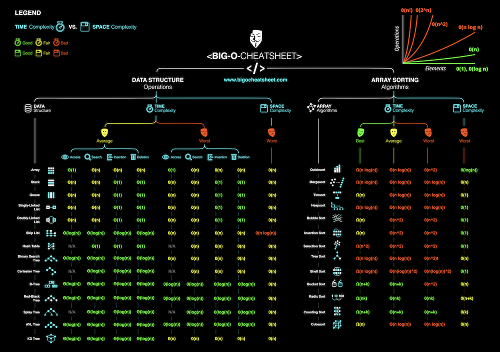

# cheat-sheets
Cheat Sheets cho AI, Neural Networks, Machine Learning, Deep Learning và Big Data

# PYTHON

# DATA ANALYST

# VISUALIZATION

# MACHINE LEARNING

# DEEP LEARNING

# BIGDATA

# ALGORITHM

# MLOPS

# OTHER
